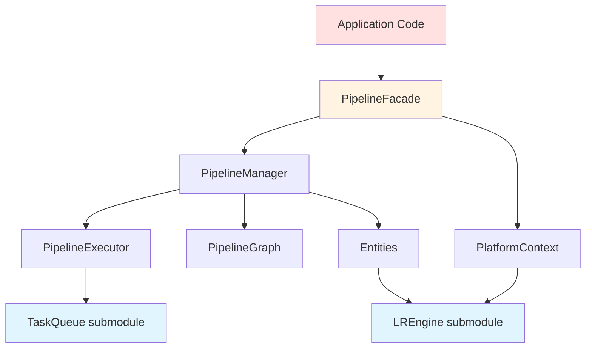

# Pipeline 架构设计文档

## 1. 概述

Pipeline 作为完整的独立前处理模块，已集成 LREngine 和 TaskQueue 作为 submodule。本文档从模块划分和框架设计角度，详细阐述多平台兼容性、输出扩展和对外接口设计。

### 1.1 设计目标

- ✅ **模块独立性**：Pipeline 作为完整独立模块，可单独编译和发布
- ✅ **跨平台一致性**：提供统一 API，屏蔽平台差异
- ✅ **高性能**：GPU 加速，多线程并行，零拷贝优化
- ✅ **易用性**：简洁 API，合理默认值，丰富文档
- ✅ **可扩展性**：插件化架构，支持自定义 Entity

### 1.2 技术栈

| 组件 | 技术 | 说明 |
|------|------|------|
| 图形渲染 | LREngine (submodule) | 跨平台渲染引擎（OpenGL/GLES/Metal） |
| 任务调度 | TaskQueue (submodule) | 高性能多线程任务队列 |
| 平台集成 | AndroidCamera / IOSCamera | 平台相机框架集成 |
| 语言 | C++17 | 核心语言 |

---

## 2. 整体架构

### 2.1 架构分层

```
┌─────────────────────────────────────────────────────────┐
│               Application Layer (应用层)                 │
│  ┌─────────────────────────────────────────────────┐   │
│  │         PipelineFacade (外观接口)                │   │
│  │  - 统一API                                       │   │
│  │  - 预设管线                                      │   │
│  │  - 简化使用                                      │   │
│  └─────────────────────────────────────────────────┘   │
└─────────────────────────────────────────────────────────┘
                           ↓
┌─────────────────────────────────────────────────────────┐
│            Pipeline Core Layer (核心层)                  │
│  ┌──────────────┐  ┌──────────────┐  ┌──────────────┐ │
│  │ Pipeline     │  │ Pipeline     │  │ Pipeline     │ │
│  │ Manager      │  │ Graph        │  │ Executor     │ │
│  └──────────────┘  └──────────────┘  └──────────────┘ │
│                                                         │
│  ┌──────────────┐  ┌──────────────┐  ┌──────────────┐ │
│  │ InputEntity  │  │ Process      │  │ OutputEntity │ │
│  │ Ext          │  │ Entities     │  │ Ext          │ │
│  └──────────────┘  └──────────────┘  └──────────────┘ │
└─────────────────────────────────────────────────────────┘
                           ↓
┌─────────────────────────────────────────────────────────┐
│          Platform Abstraction Layer (平台抽象层)         │
│  ┌─────────────────────────────────────────────────┐   │
│  │         PlatformContext (平台上下文)             │   │
│  │  ┌──────────────────┐  ┌──────────────────┐    │   │
│  │  │ Android EGL      │  │ iOS Metal        │    │   │
│  │  │ Context Manager  │  │ Context Manager  │    │   │
│  │  └──────────────────┘  └──────────────────┘    │   │
│  └─────────────────────────────────────────────────┘   │
└─────────────────────────────────────────────────────────┘
                           ↓
┌─────────────────────────────────────────────────────────┐
│           Foundation Layer (基础层 - Submodules)         │
│  ┌──────────────┐  ┌──────────────┐  ┌──────────────┐ │
│  │  LREngine    │  │  TaskQueue   │  │  STL/C++17   │ │
│  │  (Rendering) │  │  (Threading) │  │              │ │
│  └──────────────┘  └──────────────┘  └──────────────┘ │
└─────────────────────────────────────────────────────────┘
```

### 2.2 核心模块关系

```mermaid
graph TB
    App[Application] --> Facade[PipelineFacade]
    Facade --> Manager[PipelineManager]
    Facade --> Platform[PlatformContext]
    
    Manager --> Graph[PipelineGraph]
    Manager --> Executor[PipelineExecutor]
    Manager --> Input[InputEntity]
    Manager --> Output[OutputEntityExt]
    
    Input --> LREngine[LREngine]
    Output --> LREngine
    Output --> Platform
    
    Executor --> TaskQueue[TaskQueue]
    
    Platform --> AndroidEGL[Android EGL Manager]
    Platform --> IOSMetal[iOS Metal Manager]
    
    LREngine -.submodule.-> Git1[git@github.com:GavinZL/LREngine.git]
    TaskQueue -.submodule.-> Git2[https://github.com/MissYangGoGo/TaskQueue.git]
```

---

## 3. 多平台兼容性设计

### 3.1 Android 平台：GLES 上下文共享

#### 3.1.1 问题分析

Android 平台使用 GLES 渲染，存在以下挑战：

1. **跨线程上下文共享**：相机回调线程 ≠ 渲染线程
2. **OES 纹理处理**：Android 相机输出 OES 纹理，需转换为标准 2D 纹理
3. **Surface 管理**：显示 Surface、编码器 Surface 需要不同的 EGL Context

#### 3.1.2 解决方案：AndroidEGLContextManager

**设计要点：**

```cpp
// 文件：include/pipeline/platform/PlatformContext.h

class AndroidEGLContextManager {
public:
    struct Config {
        EGLContext sharedContext;  // 与相机线程共享
        EGLDisplay display;
        int32_t glesVersion = 3;
        bool offscreen = false;    // 支持离屏渲染
    };
    
    // 核心接口
    bool initialize(const Config& config);
    EGLContext createSharedContext(EGLContext sourceContext);
    bool makeCurrent();
    bool releaseCurrent();
};
```

**实现策略：**

1. **共享上下文创建**
   ```cpp
   // 从相机线程的 EGL Context 创建共享上下文
   EGLContext pipelineContext = eglCreateContext(
       display, config, 
       cameraThreadContext,  // 共享源
       contextAttribs
   );
   ```

2. **上下文切换**
   ```cpp
   // Pipeline 线程激活自己的上下文
   eglMakeCurrent(display, surface, surface, pipelineContext);
   
   // 此时可以访问相机线程创建的 OES 纹理
   glBindTexture(GL_TEXTURE_EXTERNAL_OES, cameraOESTexture);
   ```

3. **OES 纹理转换**
   ```glsl
   // 着色器片段
   #extension GL_OES_EGL_image_external : require
   uniform samplerExternalOES uOESTexture;
   
   void main() {
       vec4 color = texture2D(uOESTexture, vTexCoord);
       // 转换为标准 RGBA
       gl_FragColor = color;
   }
   ```

#### 3.1.3 集成流程

```cpp
// AndroidCameraFramework 集成示例

// 1. 在相机初始化时获取 EGL 上下文
EGLContext cameraContext = eglGetCurrentContext();

// 2. 配置 Pipeline
PlatformContextConfig config;
config.platform = PlatformType::Android;
config.androidConfig.sharedContext = cameraContext;
config.androidConfig.display = eglGetCurrentDisplay();

// 3. 创建 Pipeline
auto pipeline = PipelineFacade::create(config);
pipeline->initialize();

// 4. 相机帧回调中输入 OES 纹理
void onCameraFrame(int oesTextureId, int width, int height, 
                   const float* matrix) {
    pipeline->feedOES(oesTextureId, width, height, matrix);
}
```

### 3.2 iOS 平台：CVPixelBuffer 与 Metal 集成

#### 3.2.1 问题分析

iOS 平台使用 Metal 渲染，需要处理：

1. **CVPixelBuffer 互操作**：相机输出 CVPixelBuffer，需高效转换为 Metal 纹理
2. **纹理缓存管理**：避免频繁创建销毁纹理，使用 CVMetalTextureCache
3. **格式兼容**：CVPixelBuffer 支持多种像素格式（NV12/BGRA 等）

#### 3.2.2 解决方案：IOSMetalContextManager

**设计要点：**

```cpp
// 文件：include/pipeline/platform/PlatformContext.h

class IOSMetalContextManager {
public:
    struct Config {
        void* metalDevice;         // MTLDevice*
        bool enableTextureCache = true;
        int32_t textureCacheMaxSize = 10;
    };
    
    // 核心接口
    std::shared_ptr<LRTexture> createTextureFromPixelBuffer(
        CVPixelBufferRef pixelBuffer,
        LRRenderContext* renderContext
    );
    
    bool copyTextureToPixelBuffer(
        std::shared_ptr<LRTexture> texture,
        CVPixelBufferRef pixelBuffer
    );
};
```

**实现策略：**

1. **CVMetalTextureCache 创建**
   ```objc
   // Objective-C++ 实现
   CVMetalTextureCacheCreate(
       kCFAllocatorDefault,
       nullptr,
       metalDevice,
       nullptr,
       &textureCache
   );
   ```

2. **CVPixelBuffer → Metal 纹理**
   ```objc
   CVMetalTextureRef cvMetalTexture;
   CVMetalTextureCacheCreateTextureFromImage(
       kCFAllocatorDefault,
       textureCache,
       pixelBuffer,
       nullptr,
       pixelFormat,
       width, height,
       0,  // planeIndex
       &cvMetalTexture
   );
   
   id<MTLTexture> metalTexture = 
       CVMetalTextureGetTexture(cvMetalTexture);
   ```

3. **封装为 LRTexture**
   ```cpp
   // 包装 Metal 纹理为 LREngine 纹理
   TextureDescriptor desc;
   desc.width = width;
   desc.height = height;
   desc.format = PixelFormat::BGRA8;  // iOS 默认
   
   auto lrTexture = renderContext->CreateTexture(desc);
   // 内部绑定 metalTexture
   ```

#### 3.2.3 LREngine 扩展：CVPixelBuffer 支持

**扩展 LRTexture 接口：**

```cpp
// 文件：LREngine/src/platform/metal/TextureMTL.h

class TextureMTL : public LRTexture {
public:
    // 新增：从 CVPixelBuffer 创建
    static TextureMTL* CreateFromPixelBuffer(
        CVPixelBufferRef pixelBuffer,
        CVMetalTextureCacheRef cache
    );
    
    // 新增：获取底层 Metal 纹理
    id<MTLTexture> getMetalTexture() const;
    
    // 新增：同步到 CVPixelBuffer
    bool syncToPixelBuffer(CVPixelBufferRef pixelBuffer);
};
```

**使用示例：**

```objc
// IOSCameraFramework 集成示例

- (void)captureOutput:(AVCaptureOutput*)output 
    didOutputSampleBuffer:(CMSampleBufferRef)sampleBuffer 
    fromConnection:(AVCaptureConnection*)connection {
    
    CVPixelBufferRef pixelBuffer = 
        CMSampleBufferGetImageBuffer(sampleBuffer);
    
    // 输入到 Pipeline
    pipeline->feedPixelBuffer(pixelBuffer, timestamp);
}

// Pipeline 内部处理
bool PipelineFacade::feedPixelBuffer(void* pixelBuffer, uint64_t timestamp) {
    CVPixelBufferRef cvBuffer = (CVPixelBufferRef)pixelBuffer;
    
    // 通过平台上下文转换
    auto texture = mPlatformContext->createTextureFromPixelBuffer(
        cvBuffer, mRenderContext
    );
    
    // 输入到管线
    return feedTexture(texture, width, height, timestamp);
}
```

### 3.3 平台上下文统一接口

**PlatformContext 设计：**

```cpp
// 文件：include/pipeline/platform/PlatformContext.h

class PlatformContext {
public:
    // 统一初始化接口
    bool initialize(const PlatformContextConfig& config);
    
    // 条件编译实现平台特定方法
#ifdef __ANDROID__
    std::shared_ptr<LRTexture> createTextureFromOES(...);
    AndroidEGLContextManager* getAndroidEGLManager();
#endif
    
#ifdef __APPLE__
    std::shared_ptr<LRTexture> createTextureFromPixelBuffer(...);
    IOSMetalContextManager* getIOSMetalManager();
#endif
    
    // 通用接口
    bool makeCurrent();
    bool releaseCurrent();
};
```

---

## 4. 输出实体 (OutputEntity) 扩展架构

### 4.1 设计目标

支持灵活的多输出目标架构，满足不同场景需求：

| 输出场景 | 输出目标 | 平台 | 说明 |
|---------|---------|------|------|
| 预览显示 | Display | All | 渲染到屏幕 |
| 视频录制 | Encoder | All | 输出到硬件编码器 |
| 应用回调 | Callback | All | 回传处理后的帧 |
| 后续处理 | Texture | All | 输出 GPU 纹理 |
| 截图保存 | File | All | 保存为图片文件 |
| iOS 编码 | CVPixelBuffer | iOS | VideoToolbox 编码 |
| Android 编码 | SurfaceTexture | Android | MediaCodec 编码 |

### 4.2 OutputEntityExt 架构

```cpp
// 文件：include/pipeline/entity/OutputEntityExt.h

class OutputEntityExt : public ProcessEntity {
public:
    // 多输出目标支持
    int32_t addOutputTarget(const OutputConfig& config);
    bool removeOutputTarget(int32_t targetId);
    void setOutputTargetEnabled(int32_t targetId, bool enabled);
    
    // 快捷配置
    int32_t setupDisplayOutput(void* surface, int width, int height);
    int32_t setupEncoderOutput(void* surface, EncoderType type);
    int32_t setupCallbackOutput(FrameCallback callback);
    
    // 平台特定
#ifdef __ANDROID__
    int32_t setupSurfaceTextureOutput(void* surfaceTexture);
#endif
#ifdef __APPLE__
    int32_t setupPixelBufferOutput(void* pixelBufferPool);
#endif
};
```

### 4.3 输出目标类型设计

```cpp
enum class OutputTargetType : uint8_t {
    Display,        // 显示到屏幕
    Encoder,        // 编码器（硬件/软件）
    Callback,       // 应用回调
    Texture,        // GPU 纹理输出
    File,           // 文件保存
    PixelBuffer,    // iOS CVPixelBuffer
    SurfaceTexture, // Android SurfaceTexture
    Custom          // 自定义扩展
};

// 每种类型对应的配置结构
struct OutputConfig {
    OutputTargetType targetType;
    bool enabled = true;
    
    // 联合配置（根据 targetType 使用）
    DisplayOutputConfig displayConfig;
    EncoderOutputConfig encoderConfig;
    CallbackOutputConfig callbackConfig;
    // ...
};
```

### 4.4 多输出处理流程

```cpp
// 内部实现：OutputEntityExt::process()

bool OutputEntityExt::process(
    const std::vector<FramePacketPtr>& inputs,
    std::vector<FramePacketPtr>& outputs,
    PipelineContext& context) {
    
    if (inputs.empty()) return false;
    FramePacketPtr input = inputs[0];
    
    // 遍历所有启用的输出目标
    std::lock_guard<std::mutex> lock(mTargetsMutex);
    for (auto& [targetId, config] : mOutputTargets) {
        if (!config.enabled) continue;
        
        // 根据类型分发处理
        switch (config.targetType) {
            case OutputTargetType::Display:
                renderToDisplay(config.displayConfig, input);
                break;
            case OutputTargetType::Encoder:
                outputToEncoder(config.encoderConfig, input);
                break;
            case OutputTargetType::Callback:
                executeCallback(config.callbackConfig, input);
                break;
            // ... 其他类型
        }
    }
    
    return true;
}
```

### 4.5 硬件编码器集成

#### 4.5.1 Android MediaCodec 集成

```cpp
struct EncoderOutputConfig {
    EncoderType encoderType = EncoderType::Hardware;
    void* encoderSurface = nullptr;  // MediaCodec 创建的 Surface
    OutputDataFormat dataFormat = OutputDataFormat::NV12;
};

bool OutputEntityExt::outputToEncoder(
    const EncoderOutputConfig& config, 
    FramePacketPtr input) {
    
    if (config.encoderType == EncoderType::MediaCodec) {
        // Android MediaCodec 通过 Surface 输入
        // 直接渲染到编码器 Surface
        ANativeWindow* window = (ANativeWindow*)config.encoderSurface;
        
        // 使用 EGL 渲染到 Surface
        renderToSurface(window, input->getTexture());
    }
}
```

#### 4.5.2 iOS VideoToolbox 集成

```cpp
#ifdef __APPLE__
int32_t OutputEntityExt::setupPixelBufferOutput(void* pixelBufferPool) {
    OutputConfig config;
    config.targetType = OutputTargetType::PixelBuffer;
    config.platformConfig.pixelBufferPool = pixelBufferPool;
    
    return addOutputTarget(config);
}

bool OutputEntityExt::outputToPlatform(
    const PlatformOutputConfig& config,
    FramePacketPtr input) {
    
    // 从纹理转换为 CVPixelBuffer
    CVPixelBufferRef pixelBuffer;
    CVPixelBufferPoolCreatePixelBuffer(
        kCFAllocatorDefault,
        (CVPixelBufferPoolRef)config.pixelBufferPool,
        &pixelBuffer
    );
    
    // 使用平台上下文进行转换
    mPlatformContext->copyTextureToPixelBuffer(
        input->getTexture(), 
        pixelBuffer
    );
    
    // 输出到 VideoToolbox 编码器
    // VTCompressionSessionEncodeFrame(encoderSession, pixelBuffer, ...);
}
#endif
```

---

## 5. 完备的对外接口设计

### 5.1 接口设计原则

1. **易用性优先**：提供 Facade 模式的高级接口
2. **分层设计**：支持高级 API 和底层 API
3. **平台一致性**：跨平台统一接口
4. **零配置启动**：合理默认值，快速上手

### 5.2 接口层次结构

```
┌─────────────────────────────────────────────────┐
│         PipelineFacade (外观接口)                │  ← 应用开发者使用
│  - 简化 API                                      │
│  - 预设配置                                      │
│  - 一键启动                                      │
└─────────────────────────────────────────────────┘
                    ↓ 委托
┌─────────────────────────────────────────────────┐
│         PipelineManager (管理器接口)              │  ← 高级用户使用
│  - Entity 管理                                   │
│  - 图构建                                        │
│  - 生命周期控制                                   │
└─────────────────────────────────────────────────┘
                    ↓ 使用
┌─────────────────────────────────────────────────┐
│    PipelineGraph / PipelineExecutor (核心接口)   │  ← 框架内部
│  - 图拓扑                                        │
│  - 执行调度                                      │
└─────────────────────────────────────────────────┘
```

### 5.3 PipelineFacade API 设计

#### 5.3.1 创建和初始化

```cpp
// 文件：include/pipeline/PipelineFacade.h

// 1. 使用预设快速创建
PipelineFacadeConfig config;
config.preset = PipelinePreset::CameraPreview;  // 相机预览预设
config.platformConfig.platform = PlatformType::Android;

auto pipeline = PipelineFacade::create(config);
pipeline->initialize();
pipeline->start();

// 2. 自动检测平台
auto pipeline = PipelineFacade::create(
    getRecommendedConfig(PipelinePreset::CameraPreview, PlatformType::Android)
);
```

#### 5.3.2 输入接口

```cpp
// 统一输入接口，自动识别格式
pipeline->feedFrame(data, width, height, InputFormat::NV12);

// 平台特定输入（条件编译）
#ifdef __ANDROID__
pipeline->feedOES(oesTextureId, width, height, transformMatrix);
#endif

#ifdef __APPLE__
pipeline->feedPixelBuffer(pixelBuffer);
#endif
```

#### 5.3.3 输出配置

```cpp
// 链式配置多个输出
pipeline->setupDisplayOutput(surface, 1920, 1080)
        ->setupEncoderOutput(encoderSurface)
        ->setupCallbackOutput([](FramePacketPtr frame) {
            // 处理回调
        });
```

#### 5.3.4 效果添加

```cpp
// 流式 API 添加效果
pipeline->addBeautyFilter(0.7f, 0.3f)
        ->addColorFilter("vintage", 0.8f)
        ->addSharpenFilter(0.5f);
```

### 5.4 错误处理和状态管理

```cpp
// 错误回调
pipeline->setErrorCallback([](const std::string& error) {
    LOG_ERROR("Pipeline error: %s", error.c_str());
});

// 状态回调
pipeline->setStateCallback([](PipelineState state) {
    switch (state) {
        case PipelineState::Running:
            LOG_INFO("Pipeline started");
            break;
        case PipelineState::Error:
            LOG_ERROR("Pipeline error");
            break;
    }
});

// 性能监控
auto stats = pipeline->getStats();
LOG_INFO("FPS: %.2f, Latency: %.2fms", 
         stats.averageFPS, stats.averageLatency);
```

---

## 6. 模块边界和依赖关系

### 6.1 模块依赖图



### 6.2 编译依赖

**CMakeLists.txt 配置：**

```cmake
# Pipeline/Pipeline/CMakeLists.txt

cmake_minimum_required(VERSION 3.18)
project(Pipeline CXX)

set(CMAKE_CXX_STANDARD 17)

# ============================================
# Submodule 依赖
# ============================================

# LREngine
add_subdirectory(third_party/LREngine)

# TaskQueue
add_subdirectory(third_party/TaskQueue)

# ============================================
# Pipeline 库
# ============================================

file(GLOB_RECURSE PIPELINE_SOURCES
    "src/core/*.cpp"
    "src/data/*.cpp"
    "src/entity/*.cpp"
    "src/pool/*.cpp"
    "src/platform/*.cpp"
)

add_library(pipeline STATIC ${PIPELINE_SOURCES})

target_include_directories(pipeline
    PUBLIC
        $<BUILD_INTERFACE:${CMAKE_CURRENT_SOURCE_DIR}/include>
        $<INSTALL_INTERFACE:include>
    PRIVATE
        ${CMAKE_CURRENT_SOURCE_DIR}/src
)

# 链接 submodules
target_link_libraries(pipeline
    PUBLIC
        lrengine
        taskqueue
)

# 平台特定链接
if(ANDROID)
    target_link_libraries(pipeline PUBLIC GLESv3 EGL android log)
elseif(IOS)
    target_link_libraries(pipeline PUBLIC 
        "-framework Metal"
        "-framework CoreVideo"
        "-framework AVFoundation"
    )
endif()
```

### 6.3 头文件组织

```
Pipeline/Pipeline/include/pipeline/
├── Pipeline.h                    # 主头文件（包含所有公共接口）
├── PipelineFacade.h              # 外观接口
├── core/
│   ├── PipelineManager.h         # 管理器
│   ├── PipelineGraph.h           # 图结构
│   ├── PipelineExecutor.h        # 执行器
│   └── PipelineConfig.h          # 配置
├── entity/
│   ├── ProcessEntity.h           # 基类
│   ├── IOEntity.h                # 输入输出实体
│   ├── OutputEntityExt.h         # 扩展输出实体
│   ├── GPUEntity.h               # GPU实体
│   └── CPUEntity.h               # CPU实体
├── data/
│   ├── FramePacket.h             # 帧数据包
│   ├── FramePort.h               # 端口
│   └── EntityTypes.h             # 类型定义
├── platform/
│   └── PlatformContext.h         # 平台上下文（新增）
└── pool/
    ├── TexturePool.h             # 纹理池
    └── FramePacketPool.h         # 数据包池
```

---

## 7. 使用示例

### 7.1 Android 相机预览 + 录制

```cpp
#include <pipeline/PipelineFacade.h>

// 1. 配置 Pipeline
PipelineFacadeConfig config;
config.preset = PipelinePreset::CameraPreview;
config.platformConfig.platform = PlatformType::Android;
config.platformConfig.androidConfig.sharedContext = cameraEGLContext;

auto pipeline = PipelineFacade::create(config);

// 2. 配置输出
int displayId = pipeline->setupDisplayOutput(previewSurface, 1920, 1080);
int encoderId = pipeline->setupEncoderOutput(encoderSurface, EncoderType::MediaCodec);

// 3. 添加效果
pipeline->addBeautyFilter(0.7f, 0.3f);
pipeline->addColorFilter("warm", 0.5f);

// 4. 启动
pipeline->start();

// 5. 相机回调中输入帧
void onCameraFrame(int oesTextureId, int width, int height, const float* matrix) {
    pipeline->feedOES(oesTextureId, width, height, matrix);
}

// 6. 停止录制时禁用编码器输出
pipeline->setOutputTargetEnabled(encoderId, false);
```

### 7.2 iOS 相机预览 + VideoToolbox 编码

```objc
#import <pipeline/PipelineFacade.h>

// 1. 配置 Pipeline
PipelineFacadeConfig config;
config.preset = PipelinePreset::CameraRecord;
config.platformConfig.platform = PlatformType::iOS;
config.platformConfig.iosConfig.metalDevice = MTLCreateSystemDefaultDevice();

auto pipeline = PipelineFacade::create(config);

// 2. 配置输出
int displayId = pipeline->setupDisplayOutput(
    (__bridge void*)metalLayer, 1920, 1080);
int pixelBufferId = pipeline->setupPixelBufferOutput(pixelBufferPool);

// 3. 添加滤镜
pipeline->addColorFilter("vintage");

// 4. 启动
pipeline->start();

// 5. 相机回调中输入 CVPixelBuffer
- (void)captureOutput:(AVCaptureOutput*)output 
    didOutputSampleBuffer:(CMSampleBufferRef)sampleBuffer 
    fromConnection:(AVCaptureConnection*)connection {
    
    CVPixelBufferRef pixelBuffer = 
        CMSampleBufferGetImageBuffer(sampleBuffer);
    
    pipeline->feedPixelBuffer(pixelBuffer);
}

// 6. 输出回调中获取编码用的 CVPixelBuffer
pipeline->setCallbackOutput([](FramePacketPtr frame) {
    CVPixelBufferRef pixelBuffer = /* 从 frame 获取 */;
    // 送入 VideoToolbox 编码
    VTCompressionSessionEncodeFrame(encoderSession, pixelBuffer, ...);
});
```

### 7.3 图像处理管线

```cpp
// 批量图像处理
auto pipeline = PipelineFacade::create(
    getRecommendedConfig(PipelinePreset::ImageProcess, getCurrentPlatform())
);

// 配置文件输出
pipeline->setupFileOutput("/output/processed_");

// 添加处理效果
pipeline->addSharpenFilter(0.8f);
pipeline->addColorFilter("cinema", 0.9f);

pipeline->start();

// 处理多张图片
for (const auto& imagePath : imageFiles) {
    uint8_t* imageData = loadImage(imagePath);
    pipeline->feedRGBA(imageData, width, height);
}

pipeline->stop();
```

---

## 8. 性能优化策略

### 8.1 零拷贝优化

1. **纹理直接传递**：避免 GPU → CPU → GPU 的数据拷贝
2. **共享纹理**：多输出目标共享同一纹理
3. **平台原生格式**：直接使用 CVPixelBuffer/SurfaceTexture

### 8.2 并行处理

1. **TaskQueue 调度**：CPU 和 GPU Entity 并行执行
2. **多线程输出**：多个输出目标并行处理
3. **异步回调**：回调在独立线程执行

### 8.3 资源池化

1. **纹理池**：复用 GPU 纹理
2. **FramePacket 池**：避免频繁内存分配
3. **FBO 池**：复用帧缓冲对象

---

## 9. 扩展性设计

### 9.1 自定义 Entity

```cpp
class MyCustomEntity : public GPUEntity {
public:
    bool process(const std::vector<FramePacketPtr>& inputs,
                std::vector<FramePacketPtr>& outputs,
                PipelineContext& context) override {
        // 自定义处理逻辑
        return true;
    }
};

// 添加到管线
pipeline->addCustomEntity(std::make_shared<MyCustomEntity>());
```

### 9.2 自定义输出目标

```cpp
OutputConfig customConfig;
customConfig.targetType = OutputTargetType::Custom;
customConfig.customOutputFunc = [](FramePacketPtr frame) {
    // 自定义输出处理
    return true;
};

pipeline->addOutputTarget(customConfig);
```

---

## 10. 测试和验证

### 10.1 单元测试

- [ ] PlatformContext 上下文创建和切换
- [ ] OutputEntityExt 多输出目标
- [ ] 格式转换正确性

### 10.2 集成测试

- [ ] Android EGL 上下文共享
- [ ] iOS CVPixelBuffer 转换
- [ ] 多输出同时工作

### 10.3 性能测试

- [ ] 1080p@30fps 稳定性
- [ ] 4K@60fps 压力测试
- [ ] 内存泄漏检测

---

## 11. 文档和示例

### 11.1 文档结构

```
Pipeline/Pipeline/
├── ARCHITECTURE_DESIGN.md        # 本文档
├── API_REFERENCE.md              # API 参考
├── INTEGRATION_GUIDE.md          # 集成指南
├── PLATFORM_GUIDE_ANDROID.md    # Android 平台指南
├── PLATFORM_GUIDE_IOS.md        # iOS 平台指南
└── examples/
    ├── android_camera_preview/
    ├── ios_camera_record/
    └── image_batch_process/
```

---

## 12. 总结

### 12.1 核心设计决策

| 决策点 | 方案 | 原因 |
|--------|------|------|
| 上下文管理 | PlatformContext 统一抽象 | 屏蔽平台差异 |
| Android EGL | 共享上下文 + 离屏渲染 | 支持跨线程纹理访问 |
| iOS Metal | CVMetalTextureCache | 零拷贝高效转换 |
| 输出架构 | OutputEntityExt 多目标 | 灵活扩展输出 |
| 接口设计 | Facade 模式 + 分层 API | 易用性和灵活性平衡 |

### 12.2 待实现功能

- [ ] PlatformContext 实现文件（.cpp）
- [ ] OutputEntityExt 实现文件
- [ ] PipelineFacade 实现文件
- [ ] Android/iOS 平台特定实现
- [ ] 单元测试和集成测试
- [ ] 示例代码和文档

### 12.3 未来扩展方向

1. **Vulkan 支持**：添加 Vulkan 渲染后端
2. **AI 加速**：集成 Core ML / NNAPI
3. **插件系统**：动态加载第三方 Entity
4. **云端处理**：支持远程处理管线

---

**文档版本**: v1.0  
**最后更新**: 2026-01-22  
**维护者**: Pipeline Team
